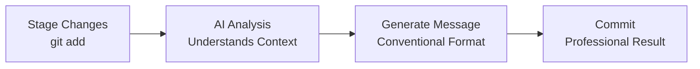

# CommitDiff

<div align="center">

[](https://opensource.org/licenses/MIT)
[](https://github.com/timothy-okoduwa/commitdiff/stargazers)
[](http://makeapullrequest.com/)

**Stop wasting time writing commit messages. Let AI analyze your code changes and generate professional, conventional commits in seconds.**

[Try It Now](https://commitdiff.vercel.app/) · [Report Bug](https://github.com/timothy-okoduwa/commitdiff/issues) · [Request Feature](https://github.com/timothy-okoduwa/commitdiff/issues)

## </div>

---

## 🚀 What is CommitDiff?

CommitDiff is an AI-powered developer tool that automatically generates meaningful, professional git commit messages by analyzing your code changes. No more staring at the terminal wondering what to write.

### ✨ Key Features

- ⚡ **Lightning Fast** - Generate commit messages in under 2 seconds
- 🎯 **Conventional Commits** - Follows conventional commit standards automatically
- 🤖 **AI-Powered** - Uses GPT-4o-mini to understand your code changes contextually
- 🔒 **Privacy First** - Your code diffs are processed securely and never stored
- 💻 **Dual Interface** - Use from terminal or browser, whatever fits your workflow
- 🌐 **Open Source** - Free and open source, contribute or customize as needed

### 📊 Why CommitDiff?

| Problem                                                         | Solution                                                                      |
| --------------------------------------------------------------- | ----------------------------------------------------------------------------- |
| Writing good commit messages is time-consuming and inconsistent | CommitDiff analyzes your actual code changes with AI                          |
| Most developers default to vague messages like "fix stuff"      | Generates professional, conventional commits that accurately describe changes |
| Maintaining clean git histories across teams is difficult       | Enforces consistent commit standards automatically                            |

---

## 🎯 Who is this for?

- **Developers** who want consistent, professional commit messages
- **Teams** maintaining clean git histories across projects
- **Open source maintainers** enforcing conventional commit standards
- **Anyone** who's tired of writing "fix stuff" or "update code"

---

## 📦 Installation

### CLI Tool (Recommended)

```bash
npm install -g commitdiff
```

### Or use with npx (no installation required)

```bash
npx commitdiff
```

---

## 🔧 Usage

### Method 1: CLI Tool

#### Basic Usage

```bash
# Stage your changes
git add .

# Generate commit message
npx commitdiff

# Or auto-commit with the generated message
npx commitdiff --commit
```

#### Available Options

```bash
commitdiff [options]

Options:
  --commit              Automatically commit with generated message
  --style <type>        Commit style: conventional | short | detailed (default: "conventional")
  -h, --help           Display help for command
  -V, --version        Output the version number
```

#### Examples

```bash
# Generate conventional commit message
npx commitdiff

# Auto-commit with generated message
npx commitdiff --commit

# Use detailed commit style
npx commitdiff --style detailed
```

### Method 2: Web Interface

1. **Get your diff**

   ```bash
   git diff --staged
   ```

   Copy the output to your clipboard

2. **Visit the web app**
   Go to [commitdiff.vercel.app](https://commitdiff.vercel.app/)
3. **Generate**
   - Paste your diff in the text area
   - Click "Generate Commit Message"
   - Copy the generated message and use it:

   ```bash
   git commit -m "your_generated_message_here"
   ```

---

## 🎬 How It Works



1. **Stage Changes** - Stage your code changes with `git add` like you normally would
2. **AI Analysis** - AI analyzes your diff, understanding what changed, why, and how to describe it
3. **Get Message** - Receive a professional commit message following conventional commit standards

---

## 🏗️ Project Structure

```
commitdiff/
├── app/                          # Next.js app directory
│   ├── api/
│   │   ├── cli-generate/        # CLI endpoint
│   │   └── generate/            # Web app endpoint
│   ├── components/
│   │   └── CommitGenerator.tsx  # Web interface component
│   └── page.tsx                 # Landing page
├── packages/
│   └── cli/                     # CLI package
│       ├── src/
│       │   └── index.ts         # CLI entry point
│       ├── package.json
│       └── tsconfig.json
├── lib/
│   └── openrouter.ts           # OpenRouter API integration
└── package.json
```

---

## 🔑 Environment Variables

To run this project locally, you'll need to set up the following environment variables:

```env
# Required
OPENROUTER_API_KEY=your_openrouter_api_key

# For rate limiting (optional but recommended)
UPSTASH_REDIS_REST_URL=your_upstash_redis_url
UPSTASH_REDIS_REST_TOKEN=your_upstash_redis_token
```

### Getting API Keys

1. **OpenRouter API Key**
   - Visit [openrouter.ai](https://openrouter.ai/)
   - Sign up for an account
   - Generate an API key from your dashboard
2. **Upstash Redis** (for rate limiting)
   - Visit [upstash.com](https://upstash.com/)
   - Create a Redis database
   - Copy your REST URL and token

---

## 🚀 Local Development

### Prerequisites

- Node.js 18+
- npm or yarn
- Git

### Setup

1. **Clone the repository**
   ```bash
   git clone https://github.com/timothy-okoduwa/commitdiff.git
   cd commitdiff
   ```
2. **Install dependencies**
   ```bash
   npm install
   ```
3. **Set up environment variables**
   ```bash
   cp .env.example .env
   # Edit .env and add your API keys
   ```
4. **Run the development server**
   ```bash
   npm run dev
   ```
5. **Build the CLI**
   ```bash
   cd packages/cli
   npm run build
   npm link  # Makes 'commitdiff' available globally
   ```
6. **Test the CLI locally**
   ```bash
   # In any git repository
   git add .
   commitdiff
   ```

---

## 🧪 Testing

```bash
# Run all tests
npm test

# Run tests in watch mode
npm test -- --watch

# Run tests with coverage
npm test -- --coverage
```

---

## 🤝 Contributing

Contributions are what make the open source community such an amazing place to learn, inspire, and create. Any contributions you make are **greatly appreciated** .

1. Fork the Project
2. Create your Feature Branch (`git checkout -b feature/AmazingFeature`)
3. Commit your Changes (`git commit -m 'feat: add some AmazingFeature'`)
4. Push to the Branch (`git push origin feature/AmazingFeature`)
5. Open a Pull Request

See [CONTRIBUTING.md](https://claude.ai/chat/CONTRIBUTING.md) for detailed guidelines.

---

## 📝 Conventional Commits

CommitDiff follows the [Conventional Commits](https://www.conventionalcommits.org/) specification:

```
<type>[optional scope]: <description>

[optional body]

[optional footer(s)]
```

### Common Types

- `feat`: A new feature
- `fix`: A bug fix
- `docs`: Documentation only changes
- `style`: Changes that don't affect code meaning (formatting, etc)
- `refactor`: Code change that neither fixes a bug nor adds a feature
- `perf`: Performance improvements
- `test`: Adding missing tests
- `chore`: Changes to build process or auxiliary tools

---

## 🔒 Privacy & Security

- **No Data Storage** - Your git diffs are sent to OpenRouter for processing but are never stored
- **Secure Processing** - All API requests use HTTPS encryption
- **No Tracking** - We don't track or analyze your code changes
- **Rate Limited** - API is rate-limited to prevent abuse (10 requests per 10 seconds per IP)

---

## 📊 Roadmap

- [x] CLI tool
- [x] Web interface
- [x] Conventional commit format
- [ ] Custom commit templates
- [ ] Git hook integration
- [ ] VS Code extension
- [ ] Team collaboration features
- [ ] Custom AI models support
- [ ] Offline mode with local models

See the [open issues](https://github.com/timothy-okoduwa/commitdiff/issues) for a full list of proposed features and known issues.

---

## ❓ FAQ

<details>
<summary><strong>How does CommitDiff work?</strong></summary>
CommitDiff uses OpenRouter's API to access GPT-4o-mini. When you provide a git diff, the AI analyzes the code changes, understands the context, and generates a conventional commit message that accurately describes what changed and why.

</details>
<details>
<summary><strong>Is my code safe?</strong></summary>
Yes. Your git diffs are sent to OpenRouter for processing but are never stored. The API processes your request and returns the commit message immediately. No data is retained after generation.

</details>
<details>
<summary><strong>Do I need an API key?</strong></summary>
If you're using the hosted version at commitdiff.vercel.app, no API key is needed. If you're running it locally or self-hosting, you'll need an OpenRouter API key.

</details>
<details>
<summary><strong>Can I customize the commit style?</strong></summary>
Yes! Use the `--style` flag in the CLI to choose between conventional, short, or detailed formats. The default follows conventional commit standards.

</details>
<details>
<summary><strong>Does it work with all programming languages?</strong></summary>
Yes! CommitDiff works with any programming language because it analyzes git diffs, not the code itself. Whether you're writing Python, JavaScript, Go, Rust, or anything else, it works the same way.

</details>
<details>
<summary><strong>Is it free?</strong></summary>
The tool is free and open source. You can use the hosted version or self-host it.

## </details>

## 📄 License

Distributed under the MIT License. See `LICENSE` for more information.

---

## 👨‍💻 Author

**Timothy Okoduwa**

- Twitter: [@timothyokoduwa](https://twitter.com/timothyokoduwa)
- GitHub: [@timothy-okoduwa](https://github.com/timothy-okoduwa)

---

## 🙏 Acknowledgments

- [OpenRouter](https://openrouter.ai/) for AI API access
- [Vercel](https://vercel.com/) for hosting
- [Conventional Commits](https://www.conventionalcommits.org/) for the specification
- All our [contributors](https://github.com/timothy-okoduwa/commitdiff/graphs/contributors)

---

<div align="center">
**⭐ Star this repo if you find it helpful!**

Made with ❤️ by developers, for developers

[Website](https://commitdiff.vercel.app/) · [Documentation](https://github.com/timothy-okoduwa/commitdiff#readme) · [Report Bug](https://github.com/timothy-okoduwa/commitdiff/issues) · [Request Feature](https://github.com/timothy-okoduwa/commitdiff/issues)

</div>
